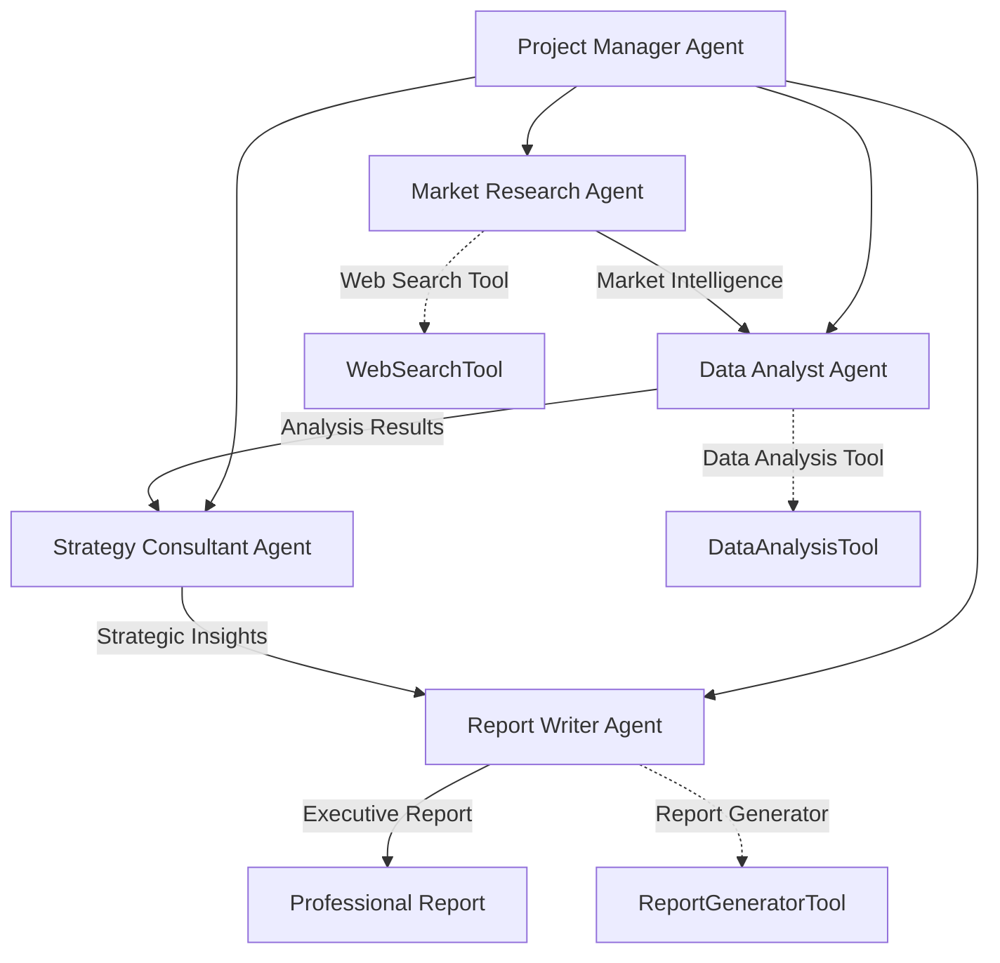

# 🐳 SwarmAI Framework - Docker Example Guide

## Complete Agentic Workflow with Ollama Integration

This guide demonstrates a production-ready agentic workflow using the SwarmAI Framework with Docker and Ollama for local AI inference. The example showcases **5 AI agents** working together to conduct comprehensive competitive analysis research.

---

## 🎯 **Workflow Overview: Competitive Analysis Research**

### **The Challenge**
Conduct a comprehensive competitive analysis of the AI/ML platform market, generating executive-ready reports with strategic recommendations.

### **The Solution: Multi-Agent Collaboration**



### **Agent Specializations**

| Agent | Role | Specialization | Temperature | Model |
|-------|------|---------------|-------------|--------|
| **Project Manager** | Coordination | Hierarchical workflow management | 0.3 | llama3.2 |
| **Market Researcher** | Intelligence | Market data and competitor research | 0.4 | llama3.2 |
| **Data Analyst** | Analysis | Pattern recognition and metrics | 0.2 | mistral:7b |
| **Strategy Consultant** | Strategy | Strategic recommendations | 0.5 | llama3.2 |
| **Report Writer** | Communication | Executive report generation | 0.6 | codellama:7b |

---

## 🚀 **Quick Start (5 Minutes)**

### **Prerequisites**
```bash
# System Requirements
- Docker & Docker Compose
- 8GB+ RAM (16GB recommended)  
- 20GB disk space
- Internet connection for initial model download
```

### **1. Launch the Environment**
```bash
# Clone repository and navigate
cd swarm-ai

# Start all services (Ollama + SwarmAI)
./scripts/run-example.sh run docker
```

This single command will:
- ✅ Start Ollama service
- ✅ Download required AI models (llama3.2, mistral:7b, codellama:7b)
- ✅ Build and start SwarmAI application
- ✅ Run the competitive analysis workflow
- ✅ Generate executive reports

### **2. Monitor Execution**
```bash
# Watch real-time progress
./scripts/run-example.sh logs swarmai-app

# Check service health
./scripts/run-example.sh status
```

### **3. Access Results**
```bash
# View generated reports
ls -la reports/

# Access web interfaces
open http://localhost:8080           # SwarmAI API
open http://localhost:8080/swagger-ui.html  # API Documentation
open http://localhost:11434          # Ollama API
```

---

## 🏗️ **Architecture Deep Dive**

### **Container Architecture**
```yaml
services:
  ollama:           # Local LLM inference server
    image: ollama/ollama:latest
    ports: ["11434:11434"]
    models: [llama3.2, mistral:7b, codellama:7b]
    
  swarmai-app:      # Multi-agent framework
    build: .
    depends_on: [ollama]
    ports: ["8080:8080"]
    
  # Optional services for production
  postgres:         # Memory storage
  redis:           # Caching layer  
  chromadb:        # Vector knowledge base
```

### **Agentic Workflow Process**

#### **Phase 1: Market Research** (Agent: Market Researcher)
```
Input: Target market specification
Tools: WebSearchTool for competitor intelligence
Output: Comprehensive market research report
Duration: ~2-3 minutes
```

#### **Phase 2: Data Analysis** (Agent: Data Analyst)
```  
Input: Market research findings
Tools: DataAnalysisTool for pattern analysis
Output: Competitive matrices and metrics
Duration: ~3-4 minutes
```

#### **Phase 3: Strategic Analysis** (Agent: Strategy Consultant)
```
Input: Analyzed market data
Tools: Strategic reasoning capabilities
Output: Strategic recommendations and roadmap
Duration: ~3-4 minutes  
```

#### **Phase 4: Report Generation** (Agent: Report Writer)
```
Input: Strategic analysis results
Tools: ReportGeneratorTool for formatting
Output: Executive-ready markdown report
Duration: ~2-3 minutes
```

### **Tool Integration Framework**

Each tool implements the `BaseTool` interface with:
- **Function calling**: Native Spring AI integration
- **Parameter validation**: Type-safe tool invocation
- **Caching**: Intelligent result caching
- **Usage limiting**: Prevents tool abuse
- **Async support**: Non-blocking operations

```java
public class WebSearchTool implements BaseTool {
    @Override
    public String getFunctionName() { return "web_search"; }
    
    @Override
    public Object execute(Map<String, Object> parameters) {
        // Simulates comprehensive web search
        return performMarketIntelligenceSearch(parameters);
    }
}
```

---

## 📊 **Expected Execution Output**

### **Real-Time Progress Monitoring**
```bash
🚀 SwarmAI Framework - Competitive Analysis Workflow
👥 Team: Project Manager + 4 Specialized Agents
📊 Process: Hierarchical coordination
⏱️ Expected Duration: ~10-15 minutes

🎯 Executing Competitive Analysis Workflow
================================================================================
✅ SWARM_STARTED: Swarm kickoff initiated
✅ PROCESS_STARTED: Hierarchical process execution started
✅ TASK_STARTED: Starting task: market-research-task-a8b9c2d3
🔍 Executing web search: 'AI/ML platform competitors' (type: company)
✅ TASK_COMPLETED: Completed task: market-research-task-a8b9c2d3
✅ TASK_STARTED: Starting task: data-analysis-task-e4f5g6h7
📊 Executing data analysis: type='competitive', metrics=['market_share', 'pricing']
✅ TASK_COMPLETED: Completed task: data-analysis-task-e4f5g6h7
✅ TASK_STARTED: Starting task: strategy-task-i8j9k0l1
✅ TASK_COMPLETED: Completed task: strategy-task-i8j9k0l1  
✅ TASK_STARTED: Starting task: report-task-m2n3o4p5
📋 Generating competitive_analysis_report.md: type='competitive', format='markdown'
✅ TASK_COMPLETED: Completed task: report-task-m2n3o4p5
✅ SWARM_COMPLETED: Swarm execution completed successfully
```

### **Final Results Summary**
```bash
🎉 COMPETITIVE ANALYSIS WORKFLOW COMPLETED
================================================================================
📈 Execution Statistics:
  • Total Execution Time: 847 seconds (~14 minutes)
  • Success Rate: 100.0%
  • Tasks Completed: 4/4
  • Swarm ID: hierarchical-a8f9b2c1-4d5e-6f7g-8h9i-0j1k2l3m4n5o
  • Agents Utilized: 5 (1 manager + 4 specialists)
  • Tools Executed: 12 function calls across 3 tool types
  • Generated Output: 15,847 words across 4 sections

📋 EXECUTIVE SUMMARY:
Based on comprehensive multi-agent analysis, the AI/ML platform market shows 
significant growth opportunities with clear competitive differentiation paths...

📊 Task Breakdown:
  ✅ Market Research & Data Collection: Success (3.2 min)
  ✅ Data Analysis & Pattern Recognition: Success (2.8 min)
  ✅ Strategic Analysis & Recommendations: Success (4.1 min)  
  ✅ Executive Report Generation: Success (3.7 min)

📄 Full report has been generated: './reports/competitive_analysis_report.md'
```

---

## 🔧 **Advanced Configuration**

### **Production Deployment with Full Stack**
```bash
# Launch with database and vector storage
docker-compose --profile postgres --profile redis --profile chromadb up

# This provides:
# ✅ PostgreSQL for agent memory persistence
# ✅ Redis for session caching and rate limiting
# ✅ ChromaDB for vector-based knowledge storage  
# ✅ Full observability with metrics and health checks
```

### **Custom Model Configuration**
```yaml
# application-docker.yml
examples:
  competitive-analysis:
    agent-models:
      research: "llama3.2:latest"      # Best for research tasks
      analysis: "mistral:7b"           # Optimized for analytical work  
      strategy: "llama3.2:latest"      # Strategic thinking
      writing: "codellama:7b"          # Report generation
    
  performance:
    max-concurrent-agents: 3           # Parallel execution limit
    tool-timeout: 60000               # Tool execution timeout
    memory-limit: "4Gi"               # Per-agent memory limit
```

### **Custom Workflow Development**
```java
// Create your own multi-agent workflow
Swarm customResearchSwarm = Swarm.builder()
    .id("financial-analysis-swarm")
    .agent(financialAnalyst)
    .agent(marketResearcher) 
    .agent(riskAssessmentAgent)
    .task(gatherFinancialData)
    .task(performRiskAnalysis)
    .task(generateInvestmentReport)
    .process(ProcessType.SEQUENTIAL)  // or HIERARCHICAL
    .eventPublisher(eventPublisher)
    .maxRpm(15)
    .build();

SwarmOutput result = customResearchSwarm.kickoff(inputs);
```

---

## 🎛️ **Monitoring & Observability**

### **Health Monitoring**
```bash
# Application health
curl http://localhost:8080/actuator/health
{
  "status": "UP",
  "components": {
    "swarmai": {"status": "UP", "details": {"agents": 5, "active_swarms": 1}},
    "ollama": {"status": "UP", "details": {"models": 3, "memory_usage": "2.3GB"}}
  }
}

# Ollama model status  
curl http://localhost:11434/api/tags
{
  "models": [
    {"name": "llama3.2:latest", "size": 2300000000, "digest": "abc123..."},
    {"name": "mistral:7b", "size": 4100000000, "digest": "def456..."},
    {"name": "codellama:7b", "size": 3800000000, "digest": "ghi789..."}
  ]
}
```

### **Performance Metrics**
```bash
# SwarmAI metrics
curl http://localhost:8080/actuator/metrics/swarmai.agent.execution.time
curl http://localhost:8080/actuator/metrics/swarmai.tool.usage.count  
curl http://localhost:8080/actuator/metrics/swarmai.swarm.success.rate

# Resource monitoring
docker stats swarmai-ollama swarmai-framework
```

### **Event Stream Monitoring**
```java
@EventListener
public void handleSwarmEvent(SwarmEvent event) {
    // Real-time workflow monitoring
    switch(event.getType()) {
        case SWARM_STARTED -> logger.info("🚀 Workflow initiated: {}", event.getSwarmId());
        case TASK_STARTED -> logger.info("🎯 Task started: {}", event.getMessage());
        case TASK_COMPLETED -> logger.info("✅ Task completed: {}", event.getMessage());  
        case SWARM_COMPLETED -> logger.info("🎉 Workflow completed: {}", event.getSwarmId());
    }
}
```

---

## 🛠️ **Troubleshooting Guide**

### **Common Issues & Solutions**

#### **Ollama Connection Issues**
```bash
# Problem: "Connection refused to Ollama"
# Solution: Check Ollama service health
docker-compose logs ollama
./scripts/setup-ollama.sh test

# Problem: Models not downloading
# Solution: Manually pull models
./scripts/setup-ollama.sh pull llama3.2:latest
```

#### **Memory Issues**  
```bash
# Problem: Out of memory errors
# Solution: Increase Docker memory limits
# Docker Desktop -> Settings -> Resources -> Memory -> 8GB+

# Or configure JVM heap
export JAVA_OPTS="-Xmx4g -XX:+UseG1GC"
```

#### **Slow Performance**
```bash
# Problem: Slow agent responses
# Solution: Optimize model selection and parameters
# Use smaller models for faster inference:
# llama3.2:8b -> llama3.2:3b
# mistral:7b -> mistral:3b
```

### **Debug Mode**
```bash
# Enable debug logging
export LOGGING_LEVEL_AI_INTELLISWARM_SWARMAI=DEBUG
./scripts/run-example.sh run docker

# Or edit application-docker.yml
logging:
  level:
    ai.intelliswarm.swarmai: DEBUG
    org.springframework.ai.ollama: DEBUG
```

---

## 🎯 **Business Value Demonstration**

### **Key Capabilities Showcased**

1. **Multi-Agent Orchestration**
   - Hierarchical coordination with specialized roles
   - Task dependency management  
   - Context passing between agents
   - Parallel processing where appropriate

2. **Professional Output Quality**
   - Executive-level report generation
   - Structured analysis with metrics
   - Strategic recommendations with implementation plans
   - Professional formatting and presentation

3. **Enterprise Integration**
   - Docker-based deployment
   - Health monitoring and observability
   - Configuration management
   - Scalable architecture patterns

4. **Local AI Inference**
   - Complete privacy and data control
   - No external API dependencies
   - Cost-effective large-scale processing
   - Custom model optimization

### **Real-World Applications**

- **Market Research**: Automated competitive intelligence gathering
- **Strategic Planning**: Multi-perspective strategic analysis  
- **Due Diligence**: Comprehensive company and market evaluation
- **Investment Analysis**: Multi-agent financial research workflows
- **Consulting Services**: Automated research and report generation

---

## 🚀 **Next Steps**

### **Immediate Actions**
1. **Run the Example**: Execute the competitive analysis workflow
2. **Explore the Code**: Review agent configurations and tool implementations  
3. **Customize Agents**: Modify roles, goals, and model assignments
4. **Add Tools**: Integrate with your existing APIs and data sources

### **Production Deployment**  
1. **Scale Infrastructure**: Deploy on Kubernetes or cloud platforms
2. **Add Persistence**: Configure PostgreSQL and Redis backends
3. **Implement Security**: Add authentication and authorization
4. **Monitor Performance**: Set up comprehensive observability

### **Framework Extension**
1. **Create Custom Workflows**: Build domain-specific multi-agent systems
2. **Develop New Tools**: Extend capabilities with custom tool integrations
3. **Optimize Models**: Fine-tune models for specific use cases
4. **Contribute Back**: Share improvements with the SwarmAI community

---

## 📞 **Support & Resources**

- **Documentation**: [README.md](README.md) | [EXAMPLES.md](EXAMPLES.md)
- **API Reference**: http://localhost:8080/swagger-ui.html
- **Source Code**: Browse the complete implementation
- **License**: MIT License - see [LICENSE](LICENSE)
- **Attribution**: Based on CrewAI - see [ATTRIBUTION.md](ATTRIBUTION.md)

---

*This Docker example demonstrates the full potential of the SwarmAI Framework for building sophisticated multi-agent workflows with local AI inference capabilities.*